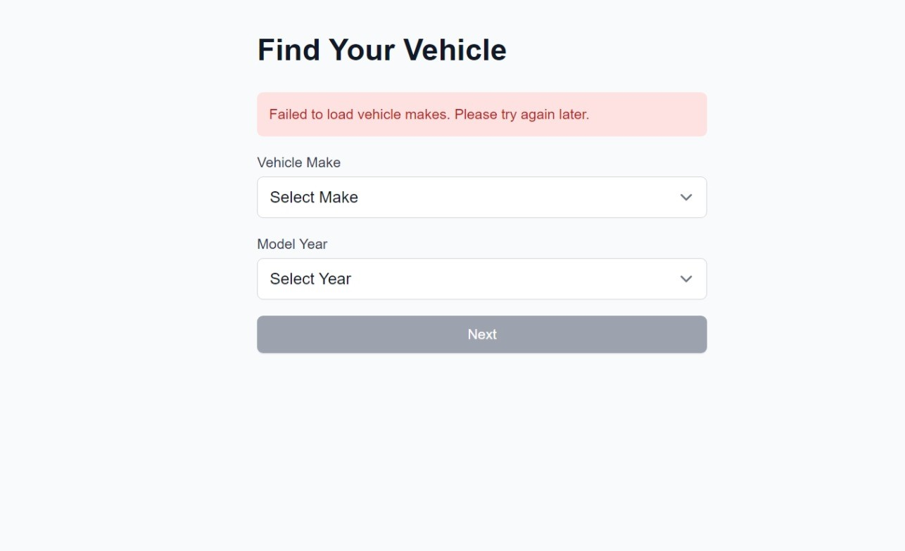
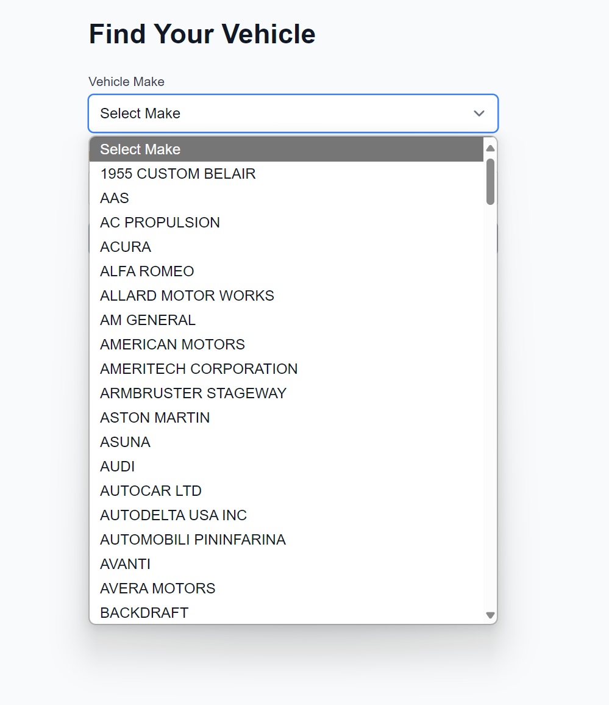
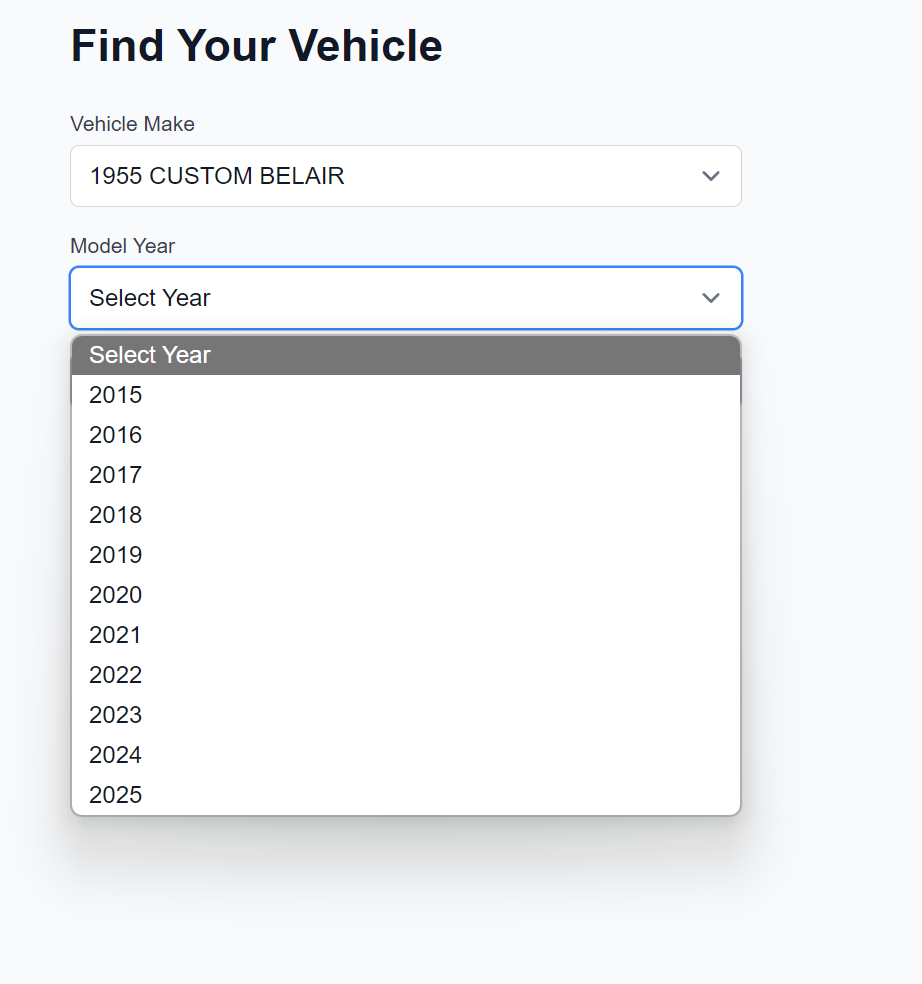
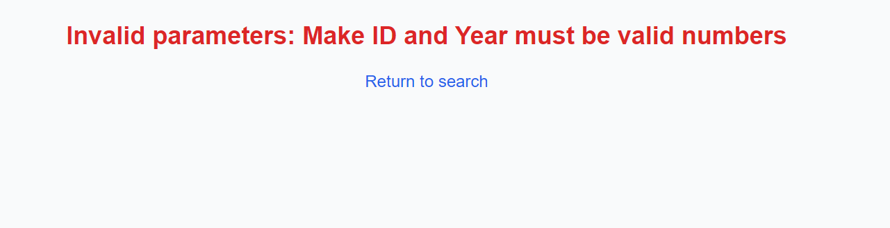
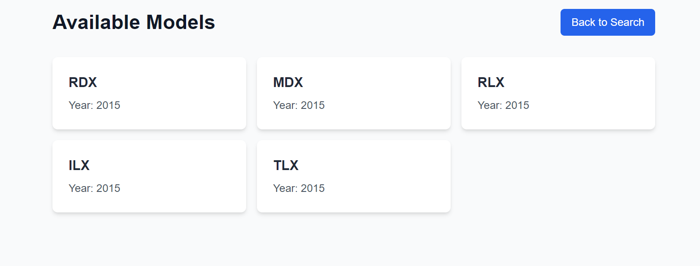

# Car Dealer App

A Next.js application that allows users to search for vehicle models by make and year using the NHTSA Vehicle API.

## Features

- Search vehicles by make and year
- Responsive design with Tailwind CSS
- Loading states and error handling
- TypeScript for type safety
- Modern UI with Geist font family

## Tech Stack

- Next.js
- TypeScript
- Tailwind CSS
- NHTSA Vehicle API
- React Suspense for loading states

## Prerequisites

- Node.js
- npm

## Getting Started

1. Clone the repository:

```bash
git clone https://github.com/yourusername/car-dealer-app.git
```

2. Install dependencies:

```bash
npm install
```

3. Run the development server:

```bash
npm run dev
```

4. Open [http://localhost:3000](http://localhost:3000) in your browser.

## Project Structure

```
src/
└── app/
    ├── components/     # Reusable components
    ├── result/         # Dynamic routes for search results
    ├── globals.css     # Global styles
    ├── layout.tsx      # Root layout
    └── page.tsx        # Home page
```

## API Integration

The application uses the NHTSA Vehicle API to fetch:

- Vehicle makes for car type
- Models for specific make and year combinations

## Project overview

<details>
  <summary>Screenshots</summary>

In case of fetching error of makes user will see next:

If everything is ok, user can select make and year:


If user tried to enter not a number in a query:

If everything went good, user will see the list of models for selected make and year:


</details>
